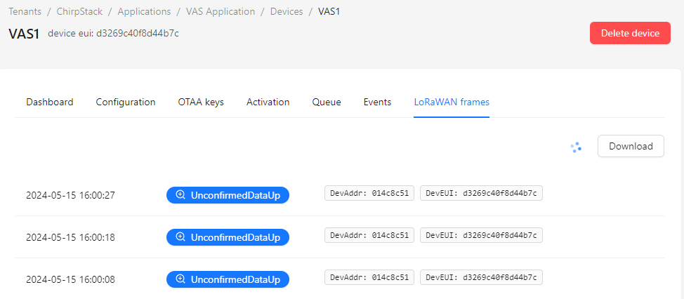

# LoRaWAN Stack for VAS sensors

## 1. Overview of the LoRaWAN Stack

A stack was implemented to connect the VAS sensors over the LoRaWAN network, collect data from these sensors, and visualise it. The main components of the stack are:  
* GNU/Linux server ([Debian](https://www.debian.org/));
* LoRaWAN Gateway ([RAK7289CV2 WisGate Edge Pro](https://store.rakwireless.com/products/rak7289-8-16-channel-outdoor-lorawan-gateway?variant=42334687789254));
* LoRaWAN Network Server ([ChirpStack](https://www.chirpstack.io));
* IoT Platform ([ThingsBoard](https://thingsboard.io/));
* Reverse Proxy ([Traefik](https://traefik.io/traefik/)).  

### 1.1. GNU/Linux server
All software components are installed on a Debian GNU/Linux 12 (Bookworm) server.  
The server is running with the following hardware configuration:
* 4 CPU cores;
* 8 GB RAM;
* 2 Hard disks (32 GB for system disk and 200 GB disk for data).
    * NOTE: 2nd HDD is optional, everything can be stored on one hard drive.
	
All ChirpStack components, ThingsBoard, and Traefik are installed on Docker and are running using Docker Compose.  

The following firewall ports should be opened:
* 22 for SSH;
* 443 for HTTPS;
* 8883 for MQTT.

The following firewall ports can be opened for debugging:
* 8080 for ChirpStack Web GUI without TLS;
* 9090 for ThingsBoard Web GUI without TLS.

Configuration of the firewall is not covered in this document.

### 1.2. LoRaWAN Gateway
[RAK7289CV2 WisGate Edge Pro](https://store.rakwireless.com/products/rak7289-8-16-channel-outdoor-lorawan-gateway?variant=42334687789254) is used as a LoRaWAN Gateway. The following hardware configuration is employed: 
* 8 Channels;
* No LTE;
* EU868 Frequency Region.

The gateway communicates with ChirpStack using an MQTT v3.1 Bridge with TLS encryption on port 8883.

### 1.3. LoRaWAN Network Server
[ChirpStack v4](https://www.chirpstack.io) is used as the LoRaWAN Network Server. All of its components (chirpstack, chirpstack-rest-api, postgres, redis, mosquitto) are installed on Docker and are running using Docker Compose. Only the EU region is enabled for LoRaWAN communication.

The LoRaWAN device repository has been imported into ChirpStack.

An MQTT connection with TLS encryption is enabled on port 8883. Port 1883 for external connections without encryption is disabled, although it can be used internally within the mosquitto container for testing and debugging.

### 1.4. IoT Platform
The [ThingsBoard](https://thingsboard.io/) Community Edition is installed as an IoT platform for data collection, processing, and visualisation [3]. An instance with a Cassandra database and Kafka queue service is used, as [recommended by ThingsBoard developers ](https://thingsboard.io/docs/user-guide/install/docker/) for a production environment. 8 GB of RAM is recommended for this setup.

### 1.5. Reverse Proxy
Out of the box, ChirpStack and ThingsBoard do not have HTTPS capabilities – they only support unencrypted connections to access their Web Dashboards. Therefore, [Traefik](https://traefik.io/traefik/) is used as a reverse proxy to implement connections with TLS encryption.

Self-signed certificates are utilized, however, there is also the option to use Let's Encrypt certificates with valid domain names.

The following domains are used:
* ChirpStack Dashboard: https://chirpstack.vas.internal/
* ThingsBoard Dashboard: https://thingsboard.vas.internal/
* Traefik Dashboard: https://traefik.vas.internal/

The Traefik Dashboard is password-protected using the basicAuth middleware from Traefik.

### 1.6. Mandatory configuration and requirements
* The LoRaWAN Gateway and ChirpStack must be on the same network. 
* Static IP addresses are required. 
* The correct IP address of the ChirpStack must be set on the LoRaWAN Gateway.
* Domains used for the reverse proxy must be configured on the DNS server, which is not included in this setup.

## 2. Configuration of the LoRaWAN Network Server (ChirpStack)
Docker compose is used to run LoRaWAN Network Server (ChirpStack), therefore docker and docker compose should be installed on the system.

Installation instructions for various operating systems can be found at the following page:
https://docs.docker.com/engine/install/

Installation example on Debian 12 using the apt repository is presented in chapter 2.1.
Also, as mentioned in the Chapter 1, ports 22, 443, 8883, 8080, 9090 should be opened.

### 2.1. Example of Docker installation on Debian 12
NOTE: These steps are provided only as example for Debian12. **If you are using any other operating system, e.g. Ubuntu LTS, please follow installation from the [Docker docummentation](https://docs.docker.com/engine/install/).**

Uninstall old versions, if installed:

    for pkg in docker.io docker-doc docker-compose podman-docker containerd runc; do sudo apt-get remove $pkg; done

Update apt package index:

    sudo apt update

Install packages to allow apt to use a repository over HTTPS:

    sudo apt install apt-transport-https ca-certificates curl gnupg lsb-release software-properties-common

Set up Docker's apt repository:

    # Add Docker's official GPG key:
    sudo apt-get update
    sudo apt-get install ca-certificates curl
    sudo install -m 0755 -d /etc/apt/keyrings
    sudo curl -fsSL https://download.docker.com/linux/debian/gpg -o /etc/apt/keyrings/docker.asc
    sudo chmod a+r /etc/apt/keyrings/docker.asc
    
    # Add the repository to Apt sources:
    echo \
      "deb [arch=$(dpkg --print-architecture) signed-by=/etc/apt/keyrings/docker.asc] https://download.docker.com/linux/debian \
      $(. /etc/os-release && echo "$VERSION_CODENAME") stable" | \
      sudo tee /etc/apt/sources.list.d/docker.list > /dev/null
    sudo apt-get update
	
Install latest version of the Docker:

    sudo apt-get install docker-ce docker-ce-cli containerd.io docker-buildx-plugin docker-compose-plugin

Verify that the installation is successful by running the hello-world image:

    sudo docker run hello-world

### 2.2. Install Docker Compose
NOTE: These instructions are provided only as an example. Installations steps of the installation of the Docker Compose are the same for Debian and Ubuntu. **If you are using any other operating system, please follow installation from the [Docker docummentation](https://docs.docker.com/compose/install/).**

Docker Compose plugin and Compose standalone are both installed for compatibility reasons.

Install the Compose plugin:

    sudo apt-get update
    sudo apt-get install docker-compose-plugin

Install Compose standalone:

    curl -SL https://github.com/docker/compose/releases/download/v2.27.1/docker-compose-linux-x86_64 -o /usr/local/bin/docker-compose

Apply executable permissions to the standalone binary in the target path for the installation:

    sudo chmod +x /usr/local/bin/docker-compose
	
Note that Compose standalone uses the `-compose` syntax instead of the current standard syntax `compose`.
For example type `docker-compose up` when using Compose standalone, instead of 
`docker compose up`.

### 2.3. Clone LoRaWAN Stack for VAS applications example repository
Configuration example of LoRaWAN Stack for VAS applications is provided in the following GitHub repository:  
https://github.com/NEUROTECHLT/LoRa_WAN-Server-Deploy.git

Install git (if it is not already installed):

    sudo apt update && sudo apt install git
	
Install git lfs:

    curl -s https://packagecloud.io/install/repositories/github/git-lfs/script.deb.sh | sudo bash
    sudo apt-get install git-lfs

Clone the repository of the LoRaWAN Stack for VAS applications:

    cd ~
    git clone https://github.com/NEUROTECHLT/LoRa_WAN-Server-Deploy.git

**NOTE**: 

* In all sections and points of this document it is assumed, that repository is cloned to the home directory of current user and name of the repository is not changed. i.e. its path is: `/home/<username>/LoRa_WAN-Server-Deploy`

 * *OR, shorter*: `~/LoRa_WAN-Server-Deploy`

Fetch LFS files:

    cd ~/LoRa_WAN-Server-Deploy
    git lfs pull

Delete all .gitkeep files, which were used to force git to track empty folders:

    cd ~/LoRa_WAN-Server-Deploy
    sudo find . -type f -name ".gitkeep" -exec rm -f {} +

Fix permissions of the ThingsBoard folders:

    cd ~/LoRa_WAN-Server-Deploy
    sudo chown -R 799:799 configuration/thingsboard-data
    sudo chown -R 799:799 configuration/thingsboard-logs
    sudo chmod 0700 configuration/thingsboard-data/db

### 2.4. Regenerate TLS certificates
There are pre-generated self-signed TLS certificates for ChirpStack, Mosquitto and Traefik in provided repository. Nonetheless, it is recommended to regenerate them.  
Docummentation on how to generate ChirpStack certificates is available [online](https://www.chirpstack.io/docs/guides/mosquitto-tls-configuration.html). However, pre-configured .json files and helper script, which gererates needed certificates and places them to correct location are provided in the repository.  
**NOTE**: Provided helper script generates certificates only for EU433 and EU868 regions. if any other region is needed, please refer to the [ChirpStack docummentation](https://www.chirpstack.io/docs/guides/mosquitto-tls-configuration.html) and/or edit provided configuration files and script according to your requirements.

Follow this procedure to regenerate ChirpStack and Mosquitto self-signed certificates:
* Install [cfssl](https://github.com/cloudflare/cfssl) utility. For Debian and apt based operating systems following command can be used:

      sudo apt update && sudo apt install golang-cfssl
* Change directory, where provided helper script to generate ChirpStack certificates is stored:

      cd ~/LoRa_WAN-Server-Deploy/chirpstack_certs
* Make helper script executable:

      chmod +x ./generate_certs.sh
	  
* Run the script to regenerate certificates:

      ./generate_certs.sh
	  
* List directory, where ChirpStack certificates are stored and make sure, that generated certificates are present:

      ls -al ~/LoRa_WAN-Server-Deploy/configuration/chirpstack/certs/
	  
	* Follofing new files should be in this directory:
	    * ca-key.pem
		* ca.pem
		* chirpstack_client_EU433-key.pem
		* chirpstack_client_EU433.pem
		* chirpstack_client_EU868-key.pem
		* chirpstack_client_EU868.pem
		* chirpstack-key.pem
		* chirpstack.pem

* List directory, where Mosquitto certificates are stored and make sure, that generated certificates are present:

      ls -al ~/LoRa_WAN-Server-Deploy/configuration/mosquitto/certs/
	  
	* Follofing files should be in this directory:
	    * ca.pem
        * mqtt-server-key.pem
        * mqtt-server.pem

Helper script and configuration file to generate Traefik self-signed wildcard certificate for  `*vas.internal` domain are also provided in the repository.  
Follow this procedure to regenerate Traefik certificate:
* Change directory, where provided helper script to generate ChirpStack certificates is stored:

      cd ~/LoRa_WAN-Server-Deploy/configuration/traefik/SelfSignedCerts
* Make helper script executable:

      chmod +x ./generate_traefik_cert.sh
	  
* Run the script to regenerate certificates:

      ./generate_traefik_cert.sh
	  
* List directory, where Traefik certificate is stored and make sure, that generated certificate is present:

      ls -al ~/LoRa_WAN-Server-Deploy/configuration/traefik/SelfSignedCerts
	  
	* Follofing new files should be in this directory:
        * vas_internal.crt
        * vas_internal.key

### 2.5. Start LoRaWAN Stack for VAS applications:
Change directory to the cloned repository of the LoRaWAN Stack for VAS applications:

    cd ~/LoRa_WAN-Server-Deploy 

Start the stack using Docker Compose:

    sudo docker-compose up

*OR*: `sudo docker-compose up -d`

**NOTE**: 
* Latter command with `-d` switch starts the stack in detached mode. i.e. no logs will be shown in current terminal and input of the terminal will be returned to the user (i.e. this terminal can be used for further needs). 
* For initial start it is recommended to start the stack without this switch and check logs to make sure, that everything is running.
* If the stack is started with first command (without `-d` switch), this terminal will not be returned to the user and logs of all services will be shown to user. Pressing Ctrl+C combination in this terminal will stop the stack.

To stop LoRaWAN Stack for VAS applications use following commands:

    cd ~/LoRa_WAN-Server-Deploy 
    sudo docker-compose stop

*OR*: `sudo docker-compose down`

**NOTE**: 
* Last command will not only stop LoRaWAN Stack, but also discard the containers and the networks they were utilizing.

If everything was done correctly, all services should be accessible after the start of the stack:
* ChirpStack Dashboard: https://chirpstack.vas.internal/
    * *OR*: http://<IP_OF_THE_SERVER>:8080
	* *OR, if stack is running on the same machine*: http://127.0.0.1:8080
* ThingsBoard Dashboard: https://thingsboard.vas.internal/
    * *OR*: http://<IP_OF_THE_SERVER>:9090
	* *OR, if stack is running on the same machine*: http://127.0.0.1:9090
* Traefik Dashboard: https://traefik.vas.internal/

Sometimes, ThingsBoard keeps restarting. This can be observed in the logs if the compose command was used to start the stack without the `-d` switch.  
This issue may occur if some steps of the instructions were skipped, or mistakes were made during these steps, and the user attempted to start the stack before correcting any errors.  
Typically, removing the used containers and networks fixes this issue. e.g. run the following commands:

    cd ~/LoRa_WAN-Server-Deploy 
    sudo docker-compose down
	sudo docker-compose up

Also, as mentioned in Chapter 1, **all used \*.vas.internal domain names should be resolvable to the IP address of the server**. System administrator must ensure this by editing settings of the used DNS server or host files or any other means. E.g. following steps can be used to edit hosts file on Linux if these domain names should be resolved to localhost (127.0.0.1):

* Open /etc/hosts file in nano (or any other) text editor:

      sudo nano /etc/hosts
	
* Append to the end of the file:

      127.0.0.1 chirpstack.vas.internal thingsboard.vas.internal traefik.vas.internal
	
Following default usernames and passwords are used:
* ChirpStack:
    * User: admin
    * Password: LoRaChirpStack2)@$
* ThingsBoard:
    * System Administrator: 
        * User: sysadmin@thingsboard.org
        * Password: sysadmin
    * Tenant Administrator:
        * User: tenant@thingsboard.org
        * Password: tenant
    * Customer User: 
        * User: customer@thingsboard.org
        * Password: customer
* Traefik Dashboard:
    * User: vasuser
    * Password: LoRaChirpStack2)@$

**NOTE**: Docker automatically resolves addresses of the services defined in the docker-compose file. But sometimes it does not work e.g. chirpstack can’t resolve postgres address. As a workaround these names can be added to the hosts file of the server. E.g.:

* Edit hosts file: `sudo nano /etc/hosts`
* Append to the hosts file: `127.0.0.1 chirpstack mosquitto postgres`

### 2.6. Add LoRaWAN Gateway to the ChirpStack
**NOTE**: The ID of the gateway (EUI or EUI64) will be needed in this step. Therefore, before proceeding further, the initial configuration of the gateway must be completed (see Chapter 3.1).

Open Web GUI of the ChirpStack by loading following web page:  
* https://chirpstack.vas.internal/
    * *OR*: http://<IP_OF_THE_SERVER>:8080/
    * *OR, if stack is running on the same machine*: http://127.0.0.1:8080

Navigate to: Tenant → Gateways  
Press “Add gateway” button at the top right corner of the page.  
Fill mandatory fields as shown in Figure 1:
* Name: can be any, e.g. WisGate_Edge_Pro_RAK7289V2
* Description: can be any, e.g.: WisGate Edge Pro (RAK7289-V2)
* Gateway ID (EUI64): should match EUI of the used LoRaWAN gateway.
    * In the case of the RAK7289CV2 WisGate Edge Pro, it can be found in the Overview page of its Web GUI, as shown at the end of the Chapter 3.1.

  

Figure 1. Add LoRaWAN Gateway

### 2.7. Create certificates for the LoRaWAN gateway
Certificates are needed to allow MQTT connection with TLS encryption.

Open Web GUI of the ChirpStack by loading following web page:
* https://chirpstack.vas.internal/
    * *OR*: http://<IP_OF_THE_SERVER>:8080/
    * *OR, if stack is running on the same machine*: http://127.0.0.1:8080
	
Navigate to: Tenant → Gateways → <GATEWAY_ADDED_IN _PREVIOUS_STEP> → TLS certificate  
Press “Generate certificate”.  
Following fields of the generated certificate should be shown:  
  

Figure 2. Example of the generated certificate for the gateway – CA certificate

  

Figure 3. Example of the generated certificate for the gateway – TLS certificate and TLS key

* CA certificate
    * Copy everything, including “-----BEGIN CERTIFICATE-----” and “-----END CERTIFICATE-----” lines to the text file and save it as **ca.pem** file.
* TLS certificate
    * Save everything, including “-----BEGIN CERTIFICATE-----” and “-----END CERTIFICATE-----” lines to the text file and save it as **client_cert.pem** file.
* TLS key
    * Save everything, including “-----BEGIN CERTIFICATE-----” and “-----END CERTIFICATE-----” lines to the text file and save it as **client_key.pem** file.

These three certificate files will be needed while configuring LoRaWAN gateway in Chapter 3.2.

### 2.8. Add new VAS devices
By default, VAS devices are programmed to use Over-The-Air-Activation (OTAA). Following steps can be used to add VAS device using OTAA. 

Open Web GUI of the ChirpStack by loading following web page:
* https://chirpstack.vas.internal/
    * *OR*: http://<IP_OF_THE_SERVER>:8080/
    * *OR, if stack is running on the same machine*: http://127.0.0.1:8080

Navigate to: Tenant → Applications → VAS Application  
Press “Add device” button as shown in the Figure 4.
  

Figure 4. Add VAS device

Fill in mandatory fields, as shown in Figure 5:
* Name: could be any, e.g.: 
    * VAS2
* Description: can be any, e.g.: 
    * 2nd VAS device
* Device EUI (EUI64): Has to match DevEUI of the VAS device, e.g.:
    * 56bfa08c5b549e71
* Device profile: VAS_OTAA

  

Figure 5. Mandatory parameters of the VAS device

Press “Submit” button after entering this information.  
After that, “OTAA keys” menu should open automatically.  
Enter following default Application key as shown in Figure 6 and press “Submit”: `2b7e151628aed2a6abf7158809cf4f3c`  

  

Figure 6. Default OTAA Application key

After that, VAS device should connect and activity should be seen in the “Events” and “LoRaWAN frames” menu entries of the VAS device as shown in Figure 7 and Figure 8.

  

Figure 7. Events of the VAS device

  

Figure 8. LoRaWAN frames of the VAS device

### 2.9. Connect ChirpStack device to the ThingsBoard
First, device has to be created in the ThingsBoard.  
* Open Web GUI of the ThingsBoard by loading following web page:
    * https://thingsboard.vas.internal/
        * *OR*: http://<IP_OF_THE_SERVER>:9090/
        * *OR, if stack is running on the same machine*: http://127.0.0.1:9090

* Login using tenant account.
* Navigate to: Entities → Devices
* Press “+” icon in the top right corner and press "Add new device" as shown in Figure 9.
  

Figure 9. Add new device in the ThingsBoard

* “Add new device” menu should open, as shown in Figure 10.
  

Figure 10. Details of the new device

* Enter name, e.g. VAS2, select “default” profile and press "Add" button.
* A window will open where you can check the device's connection to the ThingsBoard as shown in Figure 11. This step is not needed at the moment, therefore, simply close it.
  

Figure 11. “Device created” window

Get access token of the ThingsBoard device:
* Open Web GUI of the ThingsBoard.
* Navigate to: Entities → Devices
* Select previously created device (e.g. VAS2) i.e. click anywhere on the line of this device. After that, a window with details of this device should open, as shown in Figure 12.
  

Figure 12. Details of the ThingsBoard device

* Press “Copy access token” button. Save it somewhere.
* Example of the access token: AbA1NTFBYStefSgFVVXm

Set Device access token in ChirpStack:
* Open Web GUI of the ChirpStack by loading following web page:
    * https://chirpstack.vas.internal/
        * *OR*: http://<IP_OF_THE_SERVER>:8080/
        * *OR, if stack is running on the same machine*: http://127.0.0.1:8080
* Navigate to the configuration of the VAS device, e.g.
    * Tenant → Applications → VAS Application → VAS device (e.g. VAS2) → Configuration
* Open Variables menu entry, as shown in Figure 13 and press “Add variable” button
  

Figure 13. Variables of the ChirpStack device

* Create following variable:
    * Key: ThingsBoardAccessToken
    * Value: Access token of the ThingsBoard device, e.g. AbA1NTFBYStefSgFVVXm
* Press “Submit” button. 

After that, device should connect to the ThinsBoard and its state should be “Active”, as shown in Figure 14.
  

Figure 14. Active ThingsBoard device

## 3. Configuration of the LoRaWAN Gateway (RAK7289CV2 WisGate Edge Pro)
Manufacturer’s quick start guide is available at:  
https://docs.rakwireless.com/Product-Categories/WisGate/RAK7289-V2/Quickstart/

### 3.1. Initial configuration
Power on Gateway using included PoE Injector.

Wi-Fi AP Mode is used to make initial configuration of the gateway.
 
Connect to the gateway’s default Wi-Fi network.

By default, gateway will create a Wi-Fi Network named RAK7289_XXXX, where "XXXX" is the last two bytes of the Gateway MAC address.

Open any Web Browser and navigate to the following address: https://192.168.230.1/

Web GUI of the Gateway should open.

Set password for access to the gateway’s Web GUI as shown in Figure 15.  
* Default user is: root
  

Figure 15. Set password on the RAK Gateway

After setting the password, the dashboard of the gateway should open.

If needed, you can click on the WisGate logo at the top left corner of the Web GUI, to show names of the menu entries, as shown in Figure 16.
  

Figure 16. Press on WisGate logo, to show names of the menu entries

Set Wi-Fi password:
* Navigate to: 
    * Network → LAN (at the top of the network menu) → Expand (press arrow down) Wi-Fi entry → Settings 
* Settings of the Wi-Fi interface should open, as shown in Figure 17. Change following settings:
    * Encryption: WPA2-PSK
    * Key: <YOUR_PASSWORD>
  

Figure 17. Settings of the Wi-Fi interface

Set static IP on the LAN interface:
* Navigate to: 
    * Network → WAN (at the top of the network menu) → Expand (press arrow down) Ethernet entry → Settings
* Settings of the Ethernet interface should open as shown in Figure 18.
    * Enable WAN and disable LAN: enabled
    * Static address: selected
    * IPv4 address: <YOUR_IP>
    * IPv4 netmask: <YOUR_NETMASK>
    * IPv4 router: <YOUR_DEFAULT_GATEWAY>
    * DNS Server: <YOUR_DNS_SERVER>
        * **NOTE**: Don’t forget to press "Add" button after entering DNS address.
  

Figure 18. Settings of the Ethernet interface

Update Firmware:
* Navigate to: Settings → Firmware
* Check currently installed version of the firmware. In the example, shown in Figure 19, current version is 2.2.2. Also, the version of the firmware should be shown at the bottom of the Web GUI.
  

Figure 19. Current version of the firmware

* Check latest available firmware and release notes at the following web page:  
https://downloads.rakwireless.com/#LoRa/WisGateOS2/
* If newer firmware is available download and unzip it. 
* Then navigate to the firmware page on the Web GUI (Settings → Firmware) and upload the new firmware file (.rwi file), enable “Keep setting after updating” option and make an update.
* Wait for the update to finish.

Take a note of the Gateway’s EUI:
* EUI is needed to connect LoRaWAN gateway to the ChirpStack.
* Navigate to: Dashboard → Overview
* Various parameters of the gateway is shown, as can be seen in the example provided in Figure 20.
* As it is seen, in this example EUI is: AC1F09FFFE101087
  

Figure 20. EUI of the Gateway in the Overview page

### 3.2. Configure LoRa settings
Main LoRa settings are shown in Figure 21.
  

Figure 21. Main Settings of the LoRaWAN gateway

Open Web GUI of the Gateway.
Open LoRa settings menu and set the following settings:
* Work mode: Packet forwarder
* Log Level: NOTICE
* Frequency Plan:
    * Country: Lithuania
    * Region: EU868
* Protocol:
    * Protocol: LoRa Gateway MQTT Bridge
    * Statistic interval (s): 30
    * LoRa Gateway MQTT Bridge Parameters
        * MQTT Protocol: MQTT for ChirpStack 4.x (protobuf)
        * MQTT Broker Address: chirpstack.vas.internal
        * MQTT Broker Port: 8883
        * MQTT Version: 3.1.1
        * QoS: 1 - At Least Once
        * Keepalive interval (s): 10
        * Clean session: enabled
        * Retain: disabled
        * Enable User Authentication: disabled
        * SSL/TLS Mode: Self-signed server & client certification
        * TLS Version: TLS v1.2
        * CA certificate: uplad **ca.pem** generated in Chapter 2.7
        * Client certificate: upload **client_cert.pem** generated in Chapter 2.7
        * Client key: upload **client_key.pem** generated in Chapter 2.7

### 3.3. Edit hosts file on the gateway
At the moment of writing this document, there is a bug in the gateway’s firmware – it does not use custom DNS server, therefore, it can’t resolve internal domain name, used for LoRaWAN server, i.e. chirpstack.vas.internal.

As a workaround, this domain name can be fixed by editing hosts file on the gateway.

By default, SSH is enabled on the gateway. Therefore, use any SSH client to connect to the gateway and login using default username (root) and password, which was set during the initial configuration of the gateway. E.g.:

    ssh root@<IP_OF_THE_GATEWAY>
	
Open hosts file using vi editor:

    vi /etc/hosts
	
Press INSERT button on the keyboard.

Append entry for the domain name of the LoRaWAN server (replace the IP with the correct one):

     #ChirpStack, mosquitto server
     <IP_OF_THE_GATEWAY> chirpstack chirpstack.vas.internal mosquito
	 
Save and quit vi editor by typing following combination:

    :wq
	
	
## 4. Uninstall/Remove LoRaWAN Stack for VAS sensors
To Uninstall/Remove LoRaWAN Stack for VAS sensors navigate to its main repository:

    cd ~/LoRa_WAN-Server-Deploy
	
Stop the stack and remove its containers and networks:

	docker-compose down

Remove whole folder containing the repository of the LoRaWAN Stack for VAS sensors

    cd ~
	rm -rf ~/LoRa_WAN-Server-Deploy

